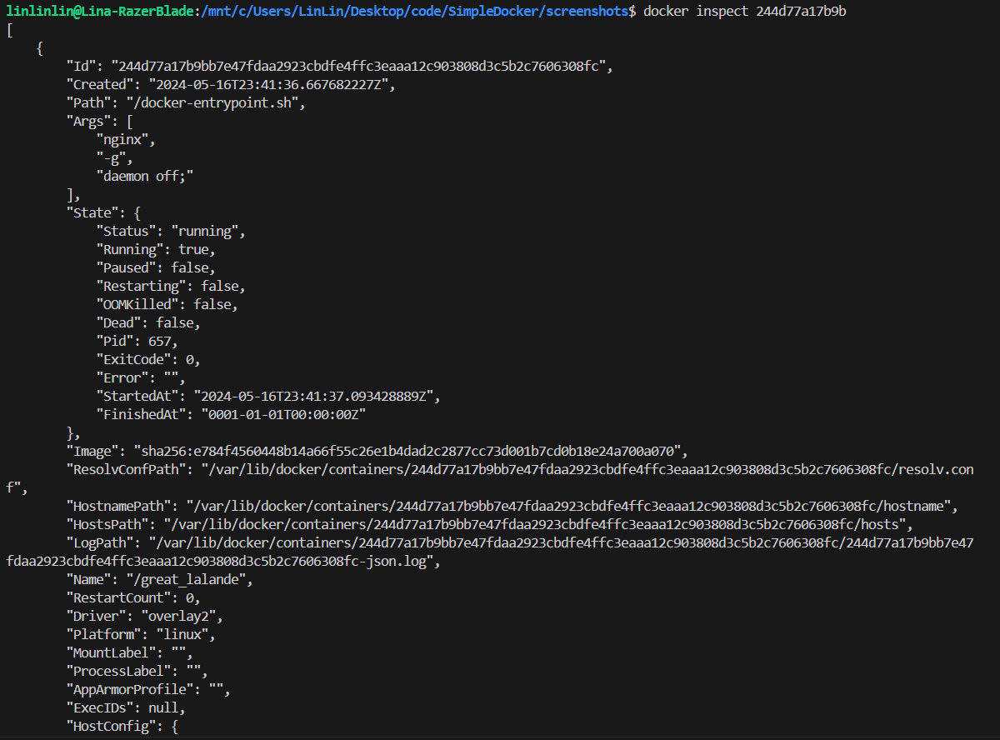
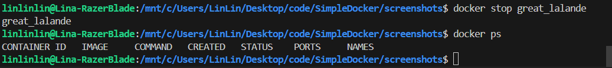
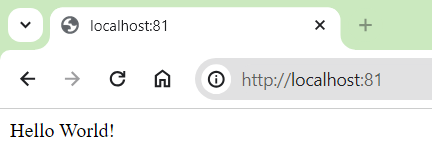

Данный проект представляет собой отчет о проделанных заданиях в рамках изучения Docker.

## Part 1. Готовый докер

- взяла официальный докер-образ с **nginx** и выкачала его при помощи `docker pull`
 
- Проверь наличие докер-образа через `docker images`
 
- Запусти докер-образ через `docker run -d [image_id|repository]`
 
- Проверь, что образ запустился через `docker ps`
 
- Посмотри информацию о контейнере через `docker inspect [container_id|container_name]`
 
 
 размер контейнера 67108864
 список замапленных портов 80/tcp
 ip контейнера 127.17.0.2
 

- Останови докер образ через `docker stop [container_id|container_name]`
 
- Проверь, что образ остановился через `docker ps`
 
- Запусти докер с портами 80 и 443 в контейнере, замапленными на такие же порты на локальной машине, через команду *run*
 
- Проверь, что в браузере по адресу *localhost:80* доступна стартовая страница **nginx**
 
- Перезапусти докер контейнер через `docker restart [container_id|container_name]`и проверь любым способом, что контейнер запустился
 

## Part 2. Операции с контейнером

- Прочитай конфигурационный файл *nginx.conf* внутри докер контейнера через команду *exec*
 
- Создай на локальной машине файл *nginx.conf*
 
- Настрой в нем по пути */status* отдачу страницы статуса сервера **nginx**
 
- Скопируй созданный файл *nginx.conf* внутрь докер-образа через команду `docker cp`
 
- Перезапусти **nginx** внутри докер-образа через команду *exec*
 
- Проверь, что по адресу *localhost:80/status* отдается страничка со статусом сервера **nginx**
 
- Экспортируй контейнер в файл *container.tar* через команду *export*
 
- Останови контейнер
 
- Удали образ через `docker rmi [image_id|repository]`, не удаляя перед этим контейнеры
 
- Удали остановленный контейнер
 
- Импортируй контейнер обратно через команду *import*
 
- Запусти импортированный контейнер
 
- Проверь, что по адресу *localhost:80/status* отдается страничка со статусом сервера **nginx**
 

## Part 3. Мини веб-сервер

- Напиши мини-сервер на **C** и **FastCgi**, который будет возвращать простейшую страничку с надписью `Hello World!`
 
- Запусти написанный мини-сервер через *spawn-fcgi* на порту 8080:
  1) скопировала файлы в docker образ командами, потом открыла оболочку
 
  2) установила gcc spawn-fcgi и libfcgi-dev внутрь образа предварительно выполнив команду `apt-get update`
 
  3) скомпилировала файл hello.c и запустила написанный мини-сервер через spawn-fcgi на порту 8080
 
- Напиши свой *nginx.conf*, который будет проксировать все запросы с 81 порта на *127.0.0.1:8080*
 
- Проверь, что в браузере по *localhost:81* отдается написанная тобой страничка
 
